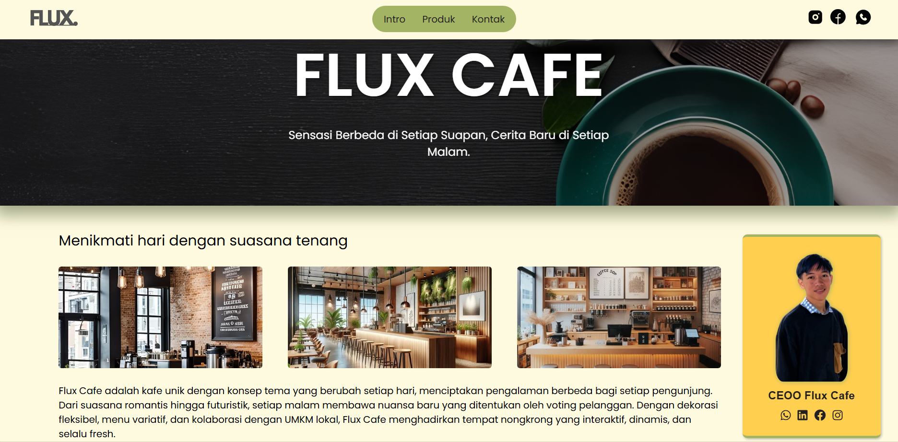

# Fluex Cafe | Landing Page

## Deskripsi
Fluex Cafe adalah sebuah situs web landing page untuk kafe bertema unik yang menawarkan pengalaman berbeda setiap harinya. Situs ini dikembangkan menggunakan **HTML, CSS, dan JavaScript** untuk memberikan tampilan yang menarik dan responsif.

## Fitur
- **Navigasi yang Intuitif**: Memudahkan pengguna untuk menjelajahi halaman.
- **Desain Responsif**: Tampilan yang optimal di berbagai perangkat.
- **Integrasi Media Sosial**: Tautan langsung ke platform media sosial.
- **Tema Kafe yang Berubah**: Menampilkan konsep tema yang dapat dipilih pelanggan.
- **Informasi Produk dan Kontak**: Mempermudah pelanggan mengetahui produk yang ditawarkan serta menghubungi kafe.

## Struktur Proyek
```
/project-root
│── /assets
│   ├── /css
│   │   └── style.css
│   ├── /font
│   ├── /img
│   │   ├── /cafe
│   │   ├── /makanan
│   │   ├── /minuman
│   │   ├── icon-flux.png
│   │   ├── image.png
│   │   ├── profile.png
│   ├── /js
│   │   ├── data.json
│   │   ├── script.js
│── index.html
│── README.md

```
## Instalasi dan Penggunaan
1. **Clone repository**
   ```sh
   git clone https://github.com/mkeyzxi/FluexCafe.git
   ```
2. **Buka file `index.html` di browser**
   Anda bisa langsung membuka file `index.html` di browser untuk melihat tampilan website.

## Teknologi yang Digunakan
- **HTML5**: Struktur halaman.
- **CSS3**: Styling dan desain responsif.
- **JavaScript**: Interaktivitas pada elemen halaman.

## Cuplikan Tampilan
Berikut adalah tampilan utama dari Fluex Cafe:



## Kontribusi
Jika ingin berkontribusi dalam pengembangan proyek ini:
1. Fork repository ini.
2. Buat branch baru (`feature-namaFitur`).
3. Commit perubahan (`git commit -m 'Menambahkan fitur X'`).
4. Push ke branch yang telah dibuat.
5. Buat pull request untuk ditinjau.

## Lisensi
Proyek ini dilisensikan di bawah MIT License - lihat file [LICENSE](LICENSE) untuk detailnya.

